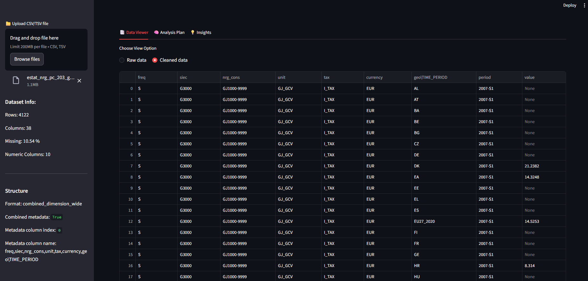
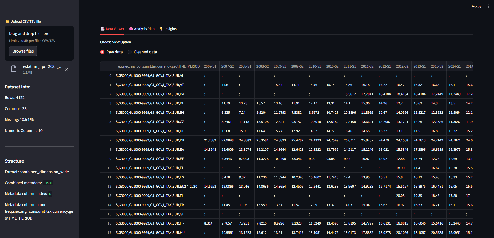
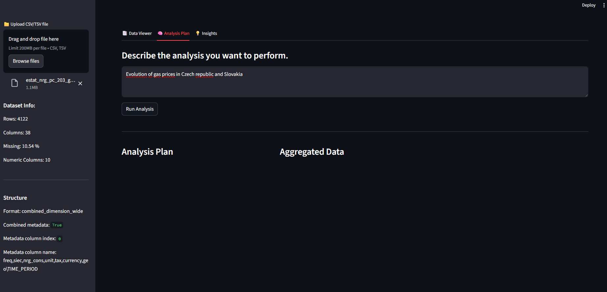
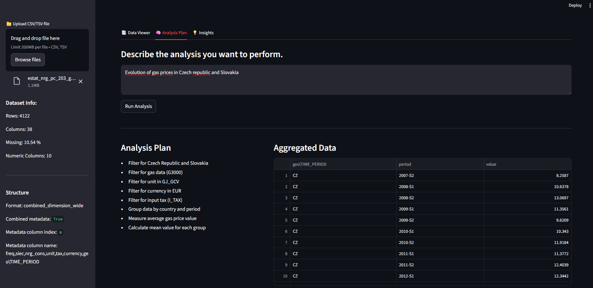
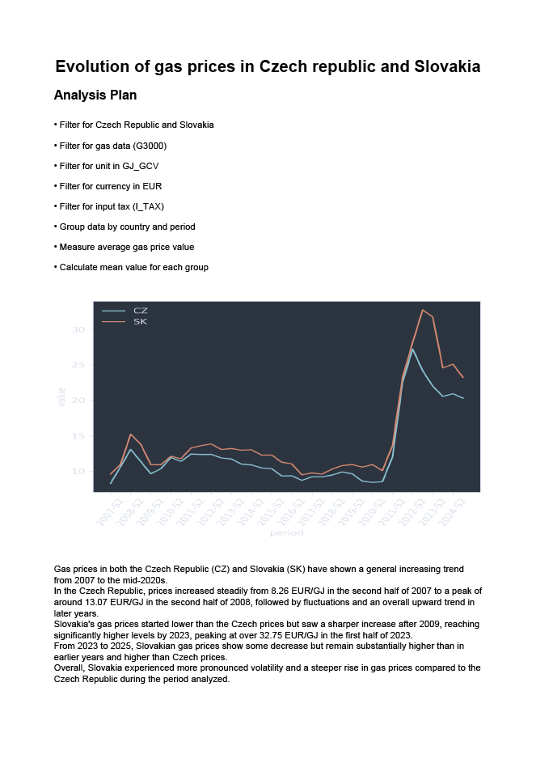

# AI Dataset Analyst

> End-to-end AI-powered data analysis application built with Streamlit, Pandas, and LLMs.

---

## Overview

AI Dataset Analyst is an interactive application designed to simplify and accelerate dataset exploration.  
It combines **traditional data analysis (Pandas)** with **LLM-powered reasoning** to automatically generate analysis plans, insights, and visualizations.

The goal of this project is to demonstrate how **Generative AI can be integrated into real data workflows**, reducing manual effort and enabling faster understanding of datasets.

---

## Key Features

- Upload CSV datasets
- Cleaned and structured data preview
- Raw data inspection
- AI-generated analysis plans (LLM-driven)
- Automated insights generation
- Dynamic visualizations
- Export results to PDF report
- Guided analysis workflow (step-by-step UI)

---

##  How It Works

The application follows a structured pipeline:

1. **Data Loading**
   - User uploads dataset (CSV, TSV)
   - Data is loaded and profiled using Pandas

2. **Data Understanding**
   - Dataset structure and metadata are analyzed
   - Column types and patterns are inferred

3. **AI Analysis Planning**
   - LLM generates an analysis plan based on dataset and user question

4. **Execution Layer**
   - Python logic executes transformations (grouping, filtering, aggregations)

5. **Insights Generation**
   - LLM interprets results and generates human-readable insights

6. **Visualization**
   - Charts are generated dynamically based on data structure

7. **Reporting**
   - Results are exported into a structured PDF report

---

##  Architecture

The project is modular and designed for extensibility:

### 🔹 Data Layer
- Pandas for data loading, cleaning, and transformations

### 🔹 Analysis Engine
- Custom logic for:
  - filtering
  - grouping
  - aggregation
  - data preparation for visualization

### 🔹 AI Layer
- OpenAI API (LLM) used for:
  - dataset understanding
  - analysis plan generation
  - insights generation

### 🔹 Visualization Layer
- Matplotlib for chart rendering

### 🔹 Reporting Layer
- ReportLab for PDF generation

### 🔹 UI Layer
- Streamlit (multi-tab interface, interactive controls)

---

##  Application Flow

### 1. Clean Data View


### 2. Raw Data View


### 3. AI Analysis Plan (Input)


### 4. AI Analysis Plan (Generated)


### 5. Insights & Visualization


### 6. PDF Export


---

##  Installation

```bash
git clone https://github.com/your-username/ai-dataset-analyst.git
cd ai-dataset-analyst

python -m venv venv
venv\Scripts\activate  # Windows

pip install -r requirements.txt
```

##  Usage
```bash
streamlit run app.py
```

##  Future Extensions & Extensions

The current version of the application is designed as a modular foundation that can be extended into a more advanced AI-driven analytics platform.

### 🔹 RAG (Retrieval-Augmented Generation)
- Integrate document-based knowledge (PDFs, reports, databases)
- Enable context-aware analysis beyond the uploaded dataset
- Use vector databases ( Pinecone, Chroma)

### 🔹 Multi-Agent Architecture
- Separate agents for:
  - data understanding
  - analysis planning
  - execution validation
  - insight generation
- Orchestrated workflows for more complex analytical tasks

### 🔹 Advanced Statistical Analysis
- Extend with statistical metrics:
  - hypothesis testing
  - anomaly detection

### 🔹 Interactive Query Interface
- Natural language querying over datasets
- Conversational analytics (chat-based interface)

### 🔹 Custom Prompting Layer
- Allow users to define their own analysis prompts
- Fine-tune outputs for domain-specific use cases

### 🔹 Cloud & Deployment
- Dockerized deployment
- Streamlit Cloud / AWS / Azure hosting
- API layer for integration with external systems

### 🔹 Data Persistence
- Save sessions and analysis history
- Store processed datasets and results

### 🔹 Performance Optimization
- Caching (Streamlit / Redis)
- Parallel processing for large datasets

---